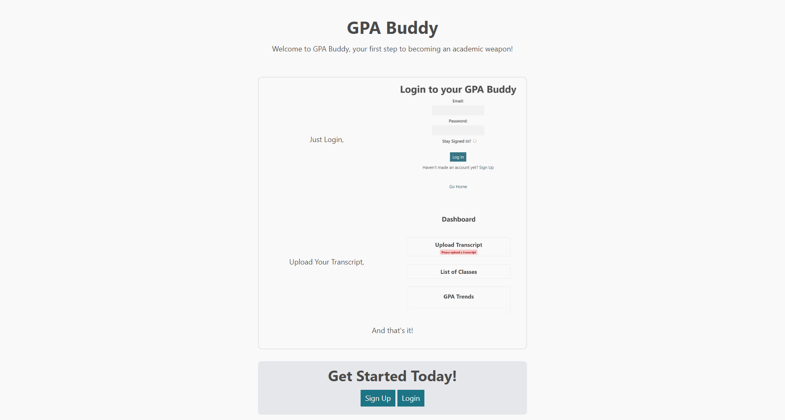

# GPA Buddy

> Grade Point Averages Made Easy!

> [!WARNING]  
> This project will be replaced with a Next.JS/PostgreSQL implementation soon. I didn't love PHP all that much :(

This project was constructed to help visualize your transcript history and give _you_ a better understanding of your grades.
Be warned though, It also has a potency for creating **academic weapons**

Just login, upload your transcript, and get analytics and patterned data right away!

# Screenshots

# Technical Details

This project is a GPA Calculator and Web Scraper designed to get data from McMaster's Mosaic system and generate GPA and grade statistics.

## Technologies

1. [PHP](https://www.php.net/) 8.2.12
2. [MySQL](https://www.mysql.com/) 10.4.32-MariaDB
3. [Plotly](https://plotly.com/javascript/) 2.29.1
4. [Flowbite](https://flowbite.com/icons/)
5. [Symfony](https://symfony.com/) 7.0

## Database Structure

The following is required to host GPA Buddy:

